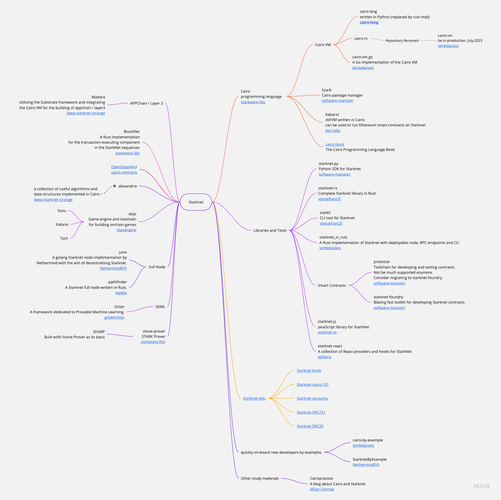

# Starknet-Tech-Stacks-Mindmap

Welcome to the Starknet Tech Stacks Mindmap repository! This open collaboration project aims to explore and document the various technology stacks associated with Starknet, a powerful blockchain platform.

In this repository, you will find a comprehensive mind map that visually organizes the different components, frameworks, tools, and languages relevant to Starknet development. The mind map serves as a valuable reference for developers, researchers, and enthusiasts interested in leveraging Starknet's capabilities.

The mind map is organized into the following categories:

- **Languages**
- **Frameworks**
- **Tools**
- **Components**
- **Resources**

## Table of Contents

- [Cairo](#cairo)
  - [Cairo VM](#cairo-vm)
    - [cairo-lang](#cairo-lang)
    - [cairo-vm](#cairo-vm)
    - [cairo-vm.go](#cairo-vm.go)
  - [Scarb](#scarb)
  - [Kakarot](#kakarot)
  - [Cairo Book](#cairo-book)
- [Libraries and Tools](#libraries-and-tools)
  - [starknet.py](#starknetpy)
  - [starknet-rs](#starknet-rs)
  - [starknet_in_rust](#starknet_in_rust)
  - [Smart Contracts](#smart-contracts)
    - [protostar](#protostar)
    - [Starknet Foundry](#starknet-foundry)
- [Starknet Edu](#starknet-edu)
  - [Starknet Book](#starknet-book)
  - [Starknet Cairo 101](#starknet-cairo-101)
  - [Starknet Accounts](#starknet-accounts)
  - [Starknet ERC721](#starknet-erc721)
  - [Starknet ERC20](#starknet-erc20)
- [APPChain Layer3](#appchain-layer3)
  - [Madara](#madara)
- [Blockifier](#blockifier)
- [OpenZeppelin/cairo-contracts](#openzeppelincairo-contracts)
- [alexandria](#alexandria)
- [dojo](#dojo)
  - [Sozu](#sozu)
  - [Katana](#katana)
  - [Torii](#torii)
- [Full Node](#full-node)
  - [pathfinder](#pathfinder)
  - [juno](#juno)
- [quickly on-board new developers by examples](#quickly-on-board-new-developers-by-examples)
  - [cairo-by-example](#cairo-by-example)
  - [StarknetByExample](#starknetbyexample)
- [ZKML](#zkml)
  - [Orion](#orion)

## Cairo

Cairo (CPU Algebraic Intermediate Representation) is a programming language for writing provable programs, where one party can prove to another that a certain computation was executed correctly without the need for this party to re-execute the same program.

https://github.com/starkware-libs/cairo

### Cairo VM

#### cairo-lang

`cairo-lang` was allowed in the production environment until July 2023, after which it was replaced by `cairo-vm`.

Repository:
https://github.com/starkware-libs/cairo-lang

#### cairo-vm

`cairo-vm` is in produciton now. Formerly known as `cairo-rs`.

https://github.com/lambdaclass/cairo-vm

#### cairo-vm.go

A Go implementation of the Cairo VM.

https://github.com/lambdaclass/cairo-vm.go

### Scarb

Cairo package manager

https://github.com/software-mansion/scarb

### Kakarot

Kakarot is an zkEVM written in Cairo. Can be used to run Ethereum smart contracts on Starknet.

Repository:
https://github.com/kkrt-labs/kakarot

### Cairo Book

https://github.com/cairo-book/cairo-book.github.io

## Libraries and Tools

### starknet.py

Pyhton SDK for Starknet

https://github.com/software-mansion/starknet.py

### starknet-rs

Complete Starknet library in Rust

https://github.com/xJonathanLEI/starknet-rs

### starknet_in_rust

A Rust implementation of Starknet with deployable node, RPC endpoints and CLI. Make use of cairo-rs declare, deploy and interact with contracts.

https://github.com/lambdaclass/starknet_in_rust

### Smart Contracts

#### protostar

Toolchain for developing and testing contracts

https://github.com/software-mansion/protostar

#### Starknet Foundry

`starknet-foundry`, created in Software Mansion, has been just released
It is an effort subsequent to protostar, the original protostar team is working on it.
Yup, protostar will not be much supported anymore, whole protostar team is working on starknet-foundry right now.

https://github.com/foundry-rs/starknet-foundry

## Starknet Edu

Repository:
https://github.com/starknet-edu

- Starknet Book: https://github.com/starknet-edu/starknetbook
- Starknet Cairo 101: https://github.com/starknet-edu/starknet-cairo-101
- Starknet Accounts: https://github.com/starknet-edu/starknet-accounts
- Starknet ERC721: https://github.com/starknet-edu/starknet-erc721
- Starknet ERC20: https://github.com/starknet-edu/starknet-erc20

## APPChain Layer3

### Madara

Utilizing the Substrate framework and integrating the Cairo VM for the building of appchain / layer3.

Substrate is an open-source Rust framework to build customizable blockchains.

The Cairo VM is specifically designed to efficiently generate Validity Proofs for program execution.

By employing state tracking and a smart contract to verify these proofs on L2, appchain created by Madara ensures secure integration with Starknet.

Repository:
https://github.com/keep-starknet-strange/madara

## Blockifier

A Rust implementation for the transaction-executing component in the StarkNet sequencer

Repository:
https://github.com/starkware-libs/blockifier

## OpenZeppelin/cairo-contracts

Repository:
https://github.com/OpenZeppelin/cairo-contracts

## alexandria

A collection of useful algorithms and data structures implemented in Cairo.

https://github.com/keep-starknet-strange/alexandria

## dojo

Game engine and toolchain for building onchain games.

- [Sozu](#sozu)
- [Katana](#katana)
- [Torii](#torii)

## Full Node

### pathfinder

A Starknet full node written in Rust.

https://github.com/eqlabs/pathfinder

### juno

A golang Starknet node implementation by Nethermind with the aim of decentralising Starknet.

https://github.com/NethermindEth/juno

## quickly on-board new developers by examples

### cairo-by-example

https://github.com/lambdaclass/cairo-by-example/

### StarknetByExample

https://github.com/NethermindEth/StarknetByExample

## ZKML

### Orion

A framework dedicated to Provable Machine Learning. It provides essential components and a new ONNX runtime for building verifiable Machine Learning models using STARKs.

https://github.com/gizatechxyz/orion

## Contribute

We encourage you to contribute to this project by suggesting additions, modifications, or corrections to the existing mind map. Your contributions can help expand the knowledge base and provide a valuable resource for the Starknet community. Whether you have expertise in specific tech stacks or want to learn more about Starknet's ecosystem, your involvement is greatly appreciated.

To contribute, simply fork this repository, make your changes, and submit a pull request.

Let's work together to create a comprehensive and up-to-date mind map of Starknet tech stacks. Join us in shaping the future of decentralized applications on Starknet!

Feel free to customize this description to fit your specific project goals and vision.
